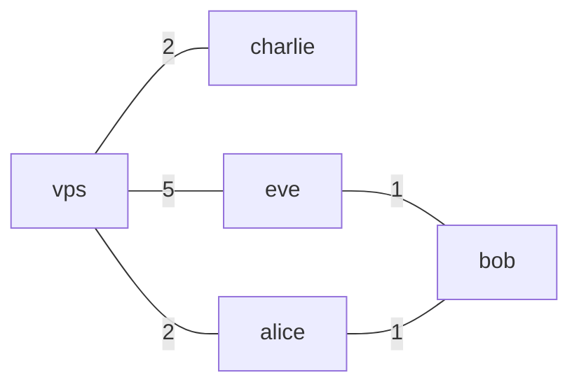
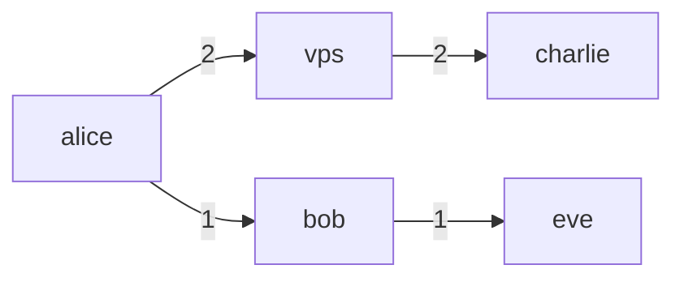
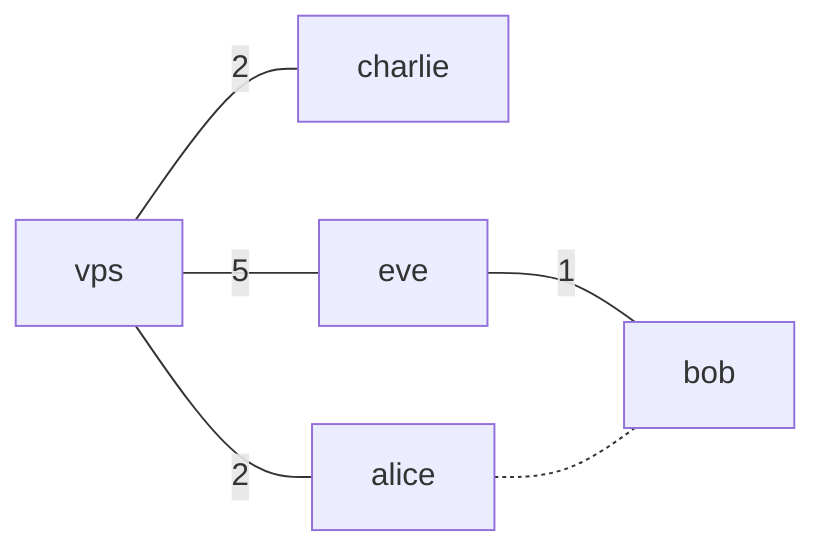
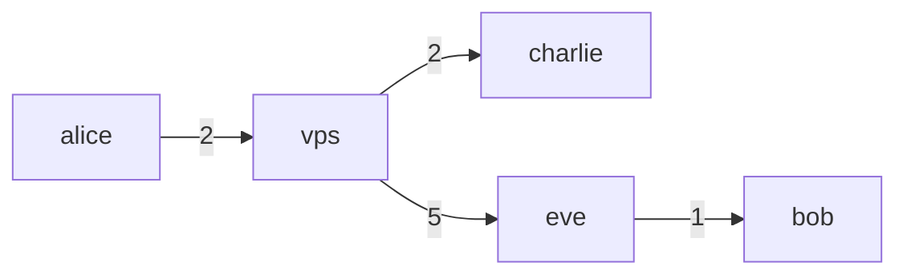

# Nylon

Nylon is a utility used to build durable, fault-tolerant and performant mesh networks built on top of WireGuard. Unlike other overlay networks, (Tailscale, Nebula, etc.) nylon is capable of actively routing data through nodes. It employs a specially tuned distance-vector routing algorithm, derived from [Babel](https://datatracker.ietf.org/doc/html/rfc8966) to ensure links have the optimal metric. Nylon will always remain backwards compatible with WireGuard, meaning that vanilla WireGuard clients can connect to the core network.

# Getting Started

Nylon is deployed as a single binary, it is up to you how you want to run it. You can refer to the sample config files under `sample-node.yaml` and `sample-central.yaml`. Nylon keypairs are the same as WireGuard keypairs, meaning you can use `wg genkey` or `./nylon key -g`.

## Simple Network

Here, we will set up a simple network consisting of 5 nodes.



*Here, the number on the edges represent some network Metric, usually latency.*

Notice that the network does not need to be fully connected for Nylon function! Each nylon node is capable of forwarding packets to its neighbours (can also be disabled in config).

### Installing

... TBA

### Setting up the network

On every node, run `./nylon new <node-name>`. This will create the file `node.yaml`. The output of this command is the public key of the node. Take note of this, as we will need paste it into the `pubkey` field of every node.

Now, on every node, copy the same `central.yaml` file. It should look similar to this:
```yaml
routers:
  - id: alice
    pubkey: afIhSoe95Fr5plativMyZL3QZslSHOBl8GWIKeqw7kg=
    prefixes:
      - 10.0.0.1/32
  - id: bob
    pubkey: 4GfHHSyVpXc+wkbjyIIONERa6Xf5EafB0nVGZLf2r2o=
    prefixes:
      - 10.0.0.2/32
    endpoints:
      - '192.168.1.1:57175'
  - id: eve
    pubkey: 2mXTTD+FYdtJm/v1vSHz8qimvCucjW9vY+nLYacXJFE=
    prefixes:
      - 10.0.0.3/32
  - id: public
    pubkey: dJcUE1qnXCQ5x8pMhFb/MZab7YrBaaHcrgfbmQI0MW4=
    prefixes:
      - 10.0.0.4/32
    endpoints:
      - '123.123.123.123:57175' # nylon supports multiple endpoints, picking the best endpoint dynamically
      - '123.123.123.124:57175'
  - id: charlie
    pubkey: WcCkKijU0brYnRzxk867HTDyYFf/cqiKTTOLSxtWoFc=
    prefixes:
      - 10.0.0.5/32
graph:
  - InternetAccess = charlie, eve, alice # groups charlie, eve, and alice which all have internet access together
  - vps, InternetAccess # connects the group InternetAccess with the node vps
  - bob, eve
  - bob, alice
```

You can now sync this file across all the nodes using `rsync` or any other method you prefer. Nylon comes with a built-in way to update the central config automatically, but you will need to set up the network first.

Notice nodes can have 0 or more accessible endpoints, and that is due to one of the key features of nylon: `Dynamic Endpoint`. Nylon will regularly try to reach out to neighbours with published endpoints, and pick the most optimal endpoint (e.g we might have a public ip and a LAN ip).

### Running the network

Before running Nylon, make sure to open UDP port `57175` so that Nylon can communicate. Without further to do, simply run `./nylon run` (more privileges may be required).

After a while, you will notice that the network has converged!

For our toy example, if we observe from node `alice`, our packet forwarding graph will look like this:



Nylon will ensure packets get delivered through the path of least metric, currently, this means latency.

### Fault recovery

What happens if one of our links go down? Nylon can handle it!

For example, we will disconnect `alice` and `bob`:



After a few moments, the network will automatically reconfigure itself. If we observe from `alice` again, our forwarding graph will look like:



Currently, Nylon is tuned to react quickly to network degradation, but converge comparably slower. This is to reduce potential fluctuations in the network.

Happy Networking!

### Vanilla (WireGuard) Clients

Nylon is designed to run on a computer or server. To connect your Phone or Tablet to your Nylon network, you can use any vanilla WireGuard client. To add a client to your network, run `./nylon client <gateway-id>`. Make sure the gateway's endpoint(s) can be reached by the Mobile Client you are configuring this for.

This command will generate a WireGuard configuration file and a Public Key. Make sure to add the Public Key and desired client address to the Central Configuration file.

Vanilla clients rely on the nylon gateway/router to advertise their presence on the network, but this relies on the passive keepalive sent by WireGuard. They also have limited functionality, including not being able to:
- Act as a router / forward packets
- Dynamically switch between routes to the Gateway server