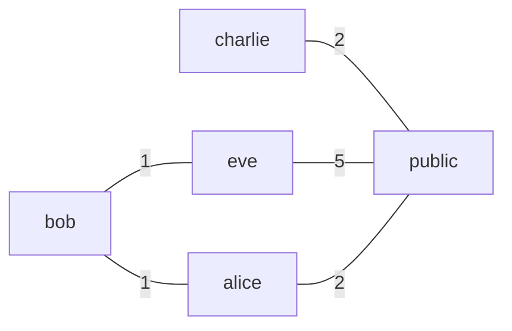

# Nylon

Nylon is a utility used to build durable, fault-tolerant and performant mesh networks. It employs a specially tuned distance-vector routing algorithm, derived from [Babel](https://datatracker.ietf.org/doc/html/rfc8966). Nylon is built as an extension to WireGuard, and remains backwards compatible with existing clients.

# Getting Started

Nylon is deployed as a single binary, it is up to you how you want to run it.

## Simple Network

Here, we will set up a simple network consisting of 5 nodes. This will be a guided set up process. You can also choose to set up the network manually using writing the config file manually, and generating key pairs using `./nylon key -g` or `wg genkey`. You can see the configuration file template in this repo, under `sample-node.yaml` and `sample-central.yaml`



*Here, the number on the edges represent some network Metric, usually latency.*

Notice that the network does not need to be fully connected for Nylon function!

### Installing

... TBA

### Setting up the network

On every node, run `./nylon new <node-name>`. This will create the file `node.yaml`. The output of this command is the public key of the node. Take note of this, as we will need paste it into the `pubkey` field of every node.

Now, on any node, create the file `central.yaml`. It should look like this:
```yaml
routers:
  - id: alice
    pubkey: afIhSoe95Fr5plativMyZL3QZslSHOBl8GWIKeqw7kg=
    prefixes:
      - 10.0.0.1/32
  - id: bob
    pubkey: 4GfHHSyVpXc+wkbjyIIONERa6Xf5EafB0nVGZLf2r2o=
    prefixes:
      - 10.0.0.2/32
    endpoints:
      - '192.168.1.1:57175'
  - id: eve
    pubkey: 2mXTTD+FYdtJm/v1vSHz8qimvCucjW9vY+nLYacXJFE=
    prefixes:
      - 10.0.0.3/32
  - id: public
    pubkey: dJcUE1qnXCQ5x8pMhFb/MZab7YrBaaHcrgfbmQI0MW4=
    prefixes:
      - 10.0.0.4/32
    endpoints:
      - '123.123.123.123:57175' # nylon supports multiple endpoints, picking the best endpoint dynamically
      - '123.123.123.124:57175'
  - id: charlie
    pubkey: WcCkKijU0brYnRzxk867HTDyYFf/cqiKTTOLSxtWoFc=
    prefixes:
      - 10.0.0.5/32
graph:
  - InternetAccess = charlie, eve, alice # groups charlie, eve, and alice which all have internet access together
  - public, InternetAccess # connects the group InternetAccess with the node public
  - bob, eve
  - bob, alice
```

You can now sync this file across all the nodes using `rsync` or any other method you prefer. Nylon comes with a built-in way to distribute config automatically, but you will need to set the network up first.

Notice that we didn't need to specify the endpoints for every node, and that is because we are using one of the key features of Nylon, Dynamic Endpoints. Sometimes a computer doesn't have an accessible IP, but it can still reach a computer that does. Nylon will still try to reach out and connect, picking the best and most reliable path. As long as there exists a valid path between two nodes, Nylon will take the optimal one.

### Running the network

Before running Nylon, make sure to open UDP port `57175` so that Nylon can communicate, and enable IP Forwarding on your respective platform.

Without further to do, simply run `./nylon run` (more privileges may be required).

Happy Networking!

### Mobile Clients

Nylon is designed to run on a computer or server. To connect your Phone or Tablet to your Nylon network, you can use any vanilla WireGuard client. To add a client to your network, run `./nylon client <gateway-id>`. Make sure the gateway's endpoint(s) can be reached by the Mobile Client you are configuring this for.

This command will generate a WireGuard configuration file and a Public Key. Make sure to add the Public Key and desired client address to the Central Configuration file.