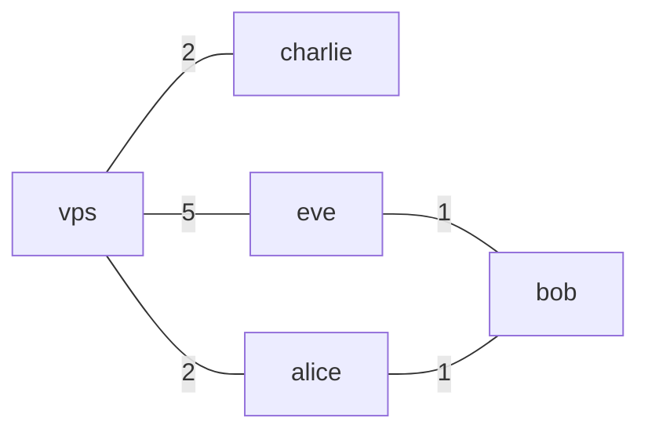
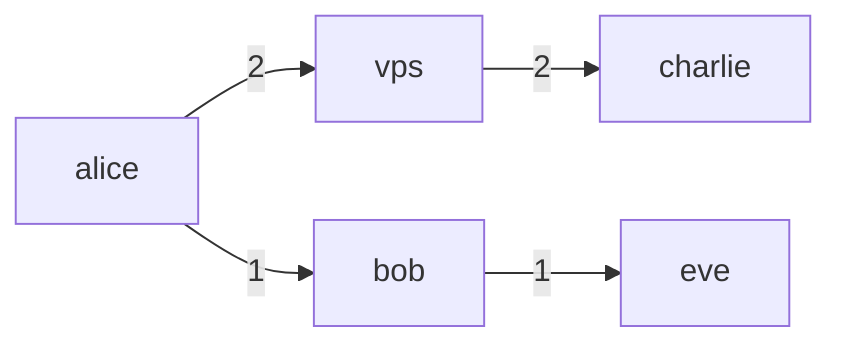
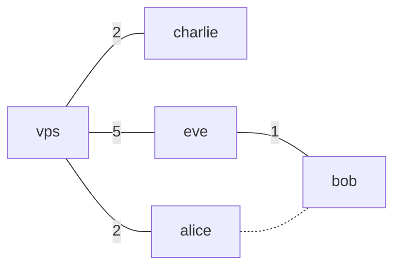
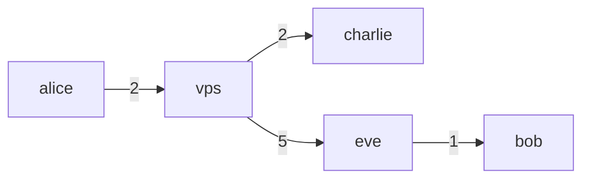

# Nylon

Nylon is a [Resilient Overlay Network](https://dl.acm.org/doi/10.1145/502034.502048) built from WireGuard, designed to be performant, secure, reliable, and most importantly, easy to use.

What is a Resilient Overlay Network?

A Resilient Overlay Network (RON) is an architecture that allows distributed applications to detect and recover from path outages and periods of degraded performance. It is an application-level overlay built on top of the existing Internet infrastructure, and it can be used to improve the reliability and performance of applications by routing traffic through intermediate nodes in the overlay network.

Technical Overview

Nylon is the integration of the Babel routing protocol with Polyamide (an advanced fork of WireGuard-go that enables routing).

### Polyamide

Polyamide is a fork of WireGuard-go that offers two notable features which enable dynamic routing:
- **Code-Defined Packet Manipulation and Redirection**: Polyamide can be configured to forward packets between its peers, and manipulate packets in transit (e.g decrementing the TTL). This is achieved completely in user-space without the need for modifying kernel routing tables.
- **Multi-endpoint Support**: Polyamide can maintain multiple endpoints for a single peer, allowing the control plane to dynamically select the best endpoint for a peer, and to send control messages over multiple physical links.

### Routing

Nylon closely implements the [Babel](https://datatracker.ietf.org/doc/html/rfc8966) routing protocol, a distance-vector routing protocol that is robust and efficient in both wireless mesh networks and wired networks. (However, nylon is not compatible with existing Babel implementations due to fundamental differences) The main implementation can be found in [core/router_algo.go](core/router_algo.go).

Here are some key points about nylon's routing protocol:
- Nylon uses in-band control messages to exchange routing information between nodes. These messages are sent over the same WireGuard tunnels used for data traffic, ensuring that routing information is not leaked. This is achieved by using Polyamide's code-defined packet manipulation to generate a pseudo "IPv8" header (as defined by `NyProtoId` in [polyamide/device/traffic_manip.go](polyamide/device/traffic_manip.go).
- Nylon maintains backwards-compatibility with vanilla WireGuard clients by treating them as leaf nodes that do not participate in routing. These "passive" nodes must attach to a "gateway" (nylon) node that advertises their presence on the network.
- Nylon uses a history-based hysteresis function to prevent frequent route switching. This is particularly important in overlay networks where the underlying physical network may be unstable (as defined in [state/endpoint.go](state/endpoint.go)).

### Main Features
- **Dynamic Routing**: nylon does not require all nodes to be reachable from each other, unlike mesh-based VPN projects (e.g Tailscale, Nebula, ZeroTier and Innernet)
- **Ease of Deployment**: nylon runs on a single UDP port (`57175`), is distributed by a single statically-linked binary, and is auto configured by a single*1* configuration file.
- **WireGuard Backwards Compatibility**: you can use your existing WireGuard clients to connect to a nylon network, with reduced functionality. Useful for mobile clients.

*1Each node does have a very minimal configuration to store its private key, and node-level config. This is a one-time setup and never needs to change.*

# Getting Started

You can download the latest release binary from the [releases page](https://github.com/encodeous/nylon/releases).

Sample systemd service and launchctl plist files can be found under the `examples` directory.

For setup instructions and an example network, please refer to the [example/README.md](example/README.md).

> [!NOTE]
> - The Linux and macOS verions are well tested, but the Windows client currently has issues. I recommend using [WireGuard for Windows](https://www.wireguard.com/install/) and connecting to a Linux/macOS machine as a passive client.
> - Nylon is still early stage software, and has not received any security audits. Feel free to report bugs and suggest features via GitHub issues. If there is any security concerns, [contact me directly](https://jiaqi.ch/).

## Conceptual Overview

In this section, we will go over some basic concepts of how nylon works, and see how it can recover from network failures.

Here, we have a network of 5 nodes, visualized as the following graph:

*the number on the edges represent some network metric, nylon will use latency.*

> [!NOTE]
> Notice that the network does not need to be fully connected for nylon function. Each nylon node is capable of forwarding packets to its neighbours (can also be disabled in config). As long as some path exists, routing can happen.

For our toy example, if we observe from node `alice`, our packet forwarding graph will look like this:

Packets sent from Alice will follow this graph to each of the destination nodes, nylon will route packets through the path of least metric.

### Fault recovery

What happens if one of our links go down?

For example, we will disconnect `alice` and `bob`:

After a few moments, the network will automatically reconfigure itself. If we observe from `alice` again, our forwarding graph will look like:

Happy Networking!

Built with sweat and tears (thankfully no blood)

`nylon` is not an official WireGuard project, and WireGuard is a registered trademark of Jason A. Donenfeld.
