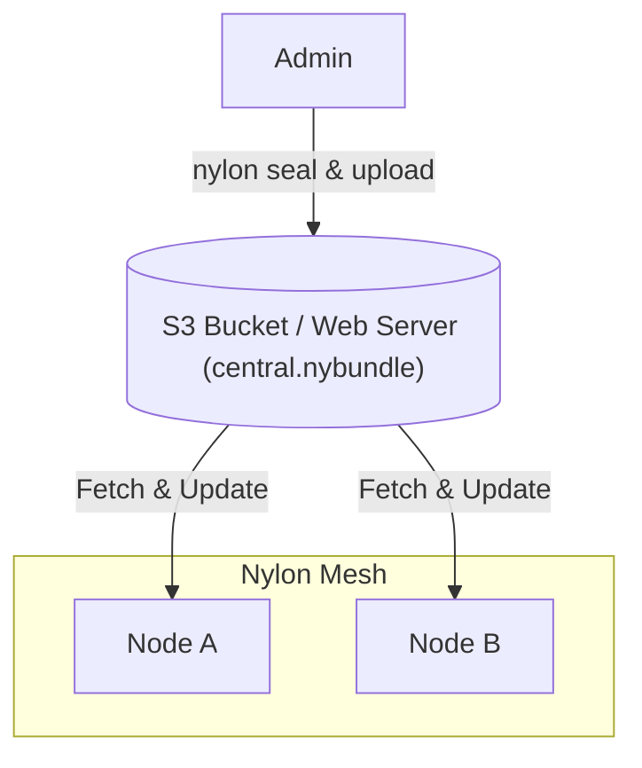

import { Steps } from '@astrojs/starlight/components';

Nylon's distribution system allows you to manage network topology from a central source using signed and encrypted "bundles".



:::caution
The distribution public key also acts as the decryption key for your network config. To keep your internal network structure private, only share this key with the nodes in your network.
:::

<Steps>

1. ### Generate a Distribution Keypair

   First, generate a keypair specifically for distribution (separate from node keys).

   ```bash
   nylon key > dist.key 2> dist.pub
   ```

2. ### Seal your Configuration

   Sign and encrypt your `central.yaml` into a `.nybundle` file.

   ```bash
   nylon seal -c central.yaml -k dist.key -o central.nybundle
   ```

3. ### Publish the Bundle

   Host `central.nybundle` on any HTTP/HTTPS server (e.g., GitHub Pages, S3, or Nginx).

4. ### Configure Nodes

   #### Initial Bootstrap (`node.yaml`)
   Nodes fetch their first central config using the `dist` block:

   ```yaml title="node.yaml"
   dist:
     url: "https://your-server.com/central.nybundle"
     key: "<contents-of-dist.pub>"
   ```

   #### Automatic Updates (`central.yaml`)
   Once bootstrapped, nodes poll the repositories defined in `central.yaml`:

   ```yaml title="central.yaml"
   dist:
     key: "<contents-of-dist.pub>"
     repos:
       - "https://your-server.com/central.nybundle"
   ```

   Nylon polls for updates every 10 seconds and applies them.

</Steps>
