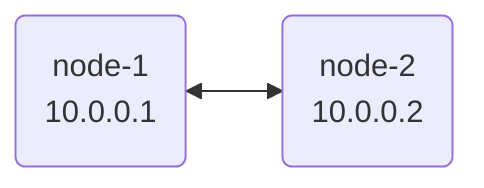

import { Steps } from '@astrojs/starlight/components';

This guide will walk you through setting up a basic nylon network with two nodes.



## Prerequisites

- Two machines with UDP port `57175` open (can configure with a different port).
- The `nylon` binary downloaded on both machines from the [releases page](https://github.com/encodeous/nylon/releases).

:::note
The Linux and macOS versions are well tested, but the Windows TUN interface has known stability issues. For Windows, we recommend using [WireGuard for Windows](https://www.wireguard.com/install/) and connecting to a Linux/macOS machine as a [passive client](/guides/wg-clients).
:::

<Steps>

1. ### Create Node Configuration

   On each node, generate `node.yaml` and a WireGuard keypair:

   ```bash
   nylon init --id node-1
   ```

   This writes the private key to a user-readable-only config file and prints
   the public key for the central configuration. Give each node a unique ID.
   Use `nylon init --help` to see optional network, DNS, distribution, and hook
   settings.

   :::tip
   Pass an existing WireGuard private key with `--key`, or use `nylon key` when
   you only need to generate a keypair.
   :::

   The generated file contains:

   ```yaml title="node.yaml"
   key: <GENERATED_PRIVATE_KEY>
   id: node-1
   port: 57175
   ```

2. ### Create Central Configuration

   The `central.yaml` file defines the topology of your network. Create one file and share it across all nodes.

   ```yaml title="central.yaml"
   routers:
     - id: node-1
       pubkey: <NODE_1_PUBLIC_KEY>
       endpoints:
         - "node1.example.com:57175" # could be a domain name
         - "192.168.1.2:57175" # could be a local ip
       addresses:
         - 10.0.0.1 # this is the internal nylon IP
     - id: node-2
       pubkey: <NODE_2_PUBLIC_KEY>
       endpoints:
         - "node2.example.com:57175"
       addresses:
         - 10.0.0.2

   # Define the connections between nodes
   graph:
     - node-1, node-2 # This means node-1 and node-2 will try to connect to each other
   ```


4. ### Validate your configuration

   Before launching, you can check that your config files are correct:

   ```bash
   nylon verify central.yaml --node node.yaml
   ```

5. ### Launch nylon

   Run nylon on both machines:

   ```bash
   sudo nylon run -c central.yaml -n node.yaml
   ```

   After a few seconds, the nodes will discover each other and establish a secure tunnel. You should be able to ping `10.0.0.2` from `node-1`.

</Steps>

## Next Steps

- Learn how to connect [Passive Nodes](/guides/wg-clients) to support edge platforms like iOS.
- Discover how to use [Config Distribution](/guides/config-distribution) to manage your network configuration with ease.
- Setup nylon without a static public IP using [Dynamic DNS & Port Forwarding](/guides/port-forward).
{/* TODO: Advanced Routing guide (Anycast, Prefix Healthchecks) */}
{/* TODO: Monitoring and Debugging guide */}
