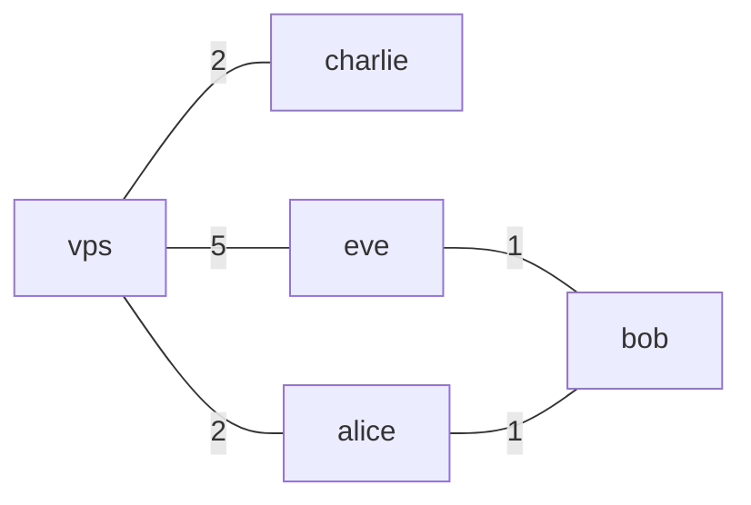
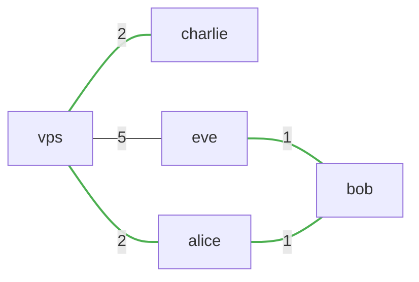
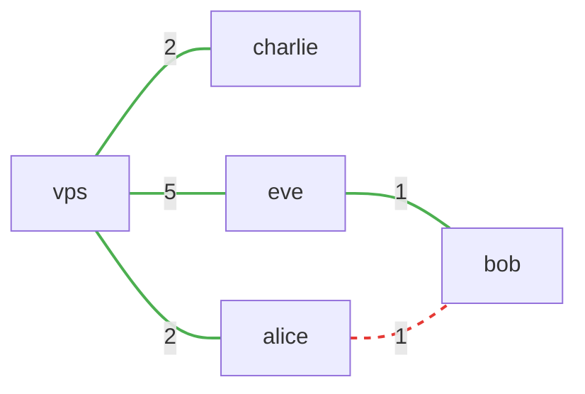

import AsciinemaPlayer from '../../components/AsciinemaPlayer.astro';
import demoCast from './assets/demo.cast?url';

Nylon is a self-healing WireGuard mesh that routes around failures. If a link goes down, nylon reroutes traffic through the next-best path in seconds. No manual intervention, no central coordination servers.

[See how nylon compares to Tailscale, Nebula, and DIY setups →](/why-nylon)

<AsciinemaPlayer src={demoCast} />

## Here's another example

Here is a network of 5 nodes, where the numbers on the edges represent the routing metric (nylon uses latency).

:::note
Nylon does not require a fully connected network. Nodes forward packets on behalf of their neighbours, so routing works as long as any path exists between two nodes.
:::

<div style="display: grid; grid-template-columns: repeat(auto-fit, minmax(300px, 1fr)); gap: 1rem; align-items: center;">
<div>



</div>
<div>

```yaml title="central.yaml"
routers:
  - id: vps
    pubkey: dJcUE1qnXCQ5x8pMhFb/MZab7YrBaaHcrgfbmQI0MW4=
    addresses: [10.0.0.1]
    endpoints:
      - "vps.encodeous.ca"
  - id: alice
    pubkey: xmfAovAKN4AY5ocK5s+/VsG9I27KrQ13Vzb0HOsLKAs=
    addresses: [10.0.0.2]
  - id: bob
    pubkey: 4GfHHSyVpXc+wkbjyIIONERa6Xf5EafB0nVGZLf2r2o=
    addresses: [10.0.0.3]
    endpoints:
      - "192.168.1.19:57175"
  - id: charlie
    pubkey: WcCkKijU0brYnRzxk867HTDyYFf/cqiKTTOLSxtWoFc=
    addresses: [10.0.0.4]
  - id: eve
    pubkey: 2mXTTD+FYdtJm/v1vSHz8qimvCucjW9vY+nLYacXJFE=
    addresses: [10.0.0.5]

graph:
  - trio = alice, charlie, eve
  - vps, trio
  - bob, eve
  - bob, alice
```

</div>
</div>

From `alice`, nylon selects the path of least metric to each destination (highlighted):



If the `alice - bob` link goes down, the network automatically reconfigures around the failure:

