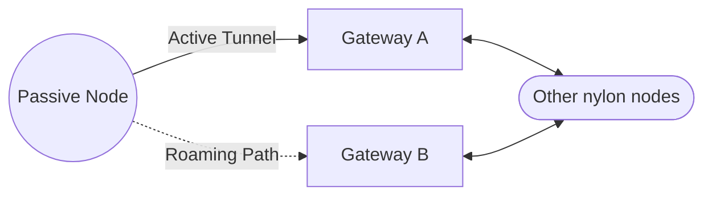

import { Aside } from '@astrojs/starlight/components';

Passive nodes (referred to as just `Clients` in the code) are standard WireGuard implementations that do not run the nylon daemon. They connect to the network via **Gateway Nodes**. In nylon, any node can serve as a gateway automatically, requiring no special configuration.

## Architecture

Unlike active routers that participate in the distance-vector protocol, passive nodes act as "stub" nodes. They are represented in the network by one or more gateway nodes that advertise their presence.

### Connecting to a Gateway
When a passive node connects to a gateway, the gateway identifies it using its WireGuard public key (defined in `central.yaml`). Once identified, the gateway begins advertising all of the addresses and prefixes associated with that passive node on the central config.

:::note

There are no health checks for the prefixes advertised by the passive node.

:::

### Seamless Roaming
Nylon supports seamless roaming for passive nodes. If a passive node switches its connection from Gateway `A` to Gateway `B`:
1. Gateway `B` detects the new connection and immediately begins advertising the node's IPs.
2. Gateway `A` detects that the passive node has stopped sending traffic, and places the route into a "Passive Hold" state (see below).
3. Gateway `A` observes the new advertisement from Gateway `B`, and preempts its own "held" route.
4. Gateway `A` stops advertising the node, allowing the network to converge on the path through Gateway `B`.

This allows mobile devices to switch between multiple VPN profiles (connected to different gateways) without losing connectivity to the internal network.

---

## Passive Hold

**Passive Hold** is an optimization designed to keep mobile devices and battery-constrained clients reachable even when they go silent.

<Aside type="note" title="Problem: Silent Clients">

Prior to Passive Hold, if a passive node stops sending packets (e.g., a mobile phone goes to sleep), the gateway does not know whether the client is still present or has disconnected. After a certain timeout, the gateway expires the route to that client and stops advertising it to the rest of the network.

This means:
1. If the client wakes up and tries to reconnect, it has to wait for route propagation again.
2. In order to keep connections alive, the client would need to send frequent keepalives, which can drain battery.

</Aside>

To solve this, when a passive node goes silent, the gateway enters a "Passive Hold" state for that node. The gateway continues to advertise the client's prefixes, but at a metric of `INF / 2` (a very high value). This allows the route to remain active in the network, but ensures that any new connection from the client to another gateway will take precedence.

At the same time, if the gateway detects any new advertisement for that client from another gateway, it will immediately preempt its own "held" route and stop advertising the client altogether. This allows for seamless roaming without the need for keepalives.

---

## Miscellaneous Notes

Nylon does support advanced routing features for passive nodes, such as **anycast**. However, there are some important caveats to be aware of when using passive nodes.
1. Anycast passive nodes will stop having their prefixes advertised when they go silent. This can lead to suboptimal routing or oscillations if the passive node sends data over a long interval. You should consider enabling keepalives for anycast nodes to ensure they remain active in the network. (This should be less than `ClientKeepaliveInterval`)
2. Passive nodes cannot advertise the same prefix as the gateway itself, or any other client which might be connected to the same gateway. This is because there is no easy way to determine which client is best.
3. Due to passive hold, there will always be gateway advertising the client's prefixes, even if the client is turned off. (Assuming the gateway is still active) This means that if a client is truly offline, the route will be effectively blackholed.
